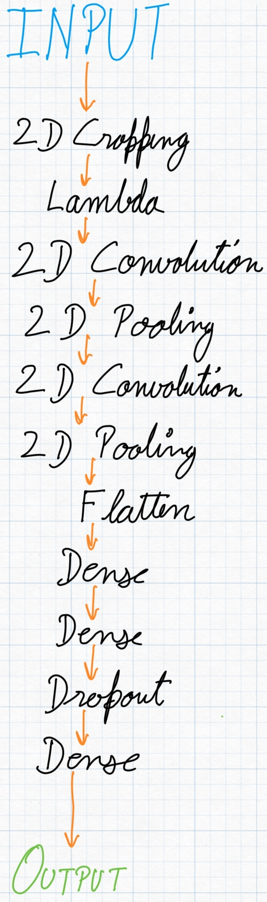
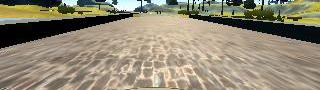
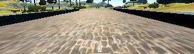
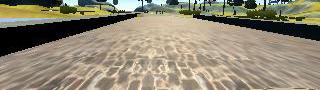
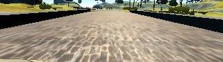

# **Behavioral Cloning** 

## Sanskar Arora

---

The goals / steps of this project are the following:
* Use the simulator to collect data of good driving behavior
* Build, a convolution neural network in Keras that predicts steering angles from images
* Train and validate the model with a training and validation set
* Test that the model successfully drives around track one without leaving the road
* Summarize the results with a written report

## Rubric Points
### Here I will consider the [rubric points](https://review.udacity.com/#!/rubrics/432/view) individually and describe how I addressed each point in my implementation.  

---
### Files Submitted & Code Quality

#### 1. Submission includes all required files and can be used to run the simulator in autonomous mode

My project includes the following files:
* model.py containing the script to create and train the model
* drive.py for driving the car in autonomous mode
* model.h5 containing a trained convolution neural network 
* writeup_report.md or writeup_report.pdf summarizing the results

#### 2. Submission includes functional code
Using the Udacity provided simulator and my drive.py file, the car can be driven autonomously around the track by executing 
```sh
python drive.py model.h5
```

model.h5 is saved with keras and tensorlow Please make sure you're running with keras and tensorflow before testing out the model. 

#### 3. Submission code is usable and readable

The model.py file contains the code for training and saving the convolution neural network. This file shows the pipeline that I have used for training and validating the model (I have used a very old laptop so my library versions are a bit old).

### Model Architecture and Training Strategy

#### 1. An appropriate model architecture has been employed

The base of my model is inspireed from LeNet with additional normalization layer, cropping layer and dropout layer.



#### 2. Attempts to reduce overfitting in the model

The model contains dropout layers in order to reduce overfitting.

#### 3. Model parameter tuning

The model used an adam optimizer, so there was no need to set learning rate or any other parameters manually.

#### 4. Appropriate training data

According to me the architecture of model and the data fed to it plays the most important role (for this project). I have employed all the data augmentations suggestions in the project resources, three cameras, image flipping, image cropping and image normalization.

### Model Architecture and Training Strategy

#### 1. Solution Design Approach

Initially, I thought the problem would require a complicated model so I ran a CNN with six convo2d layers, with depth 32, 64, 128, 128, 256, 256 respectively. The result is a model.h5 of size more than half a GB, which still shitted the bed. After about a dozen failed attempts at tuning I finally arrived at this model. Although reviewing the videos only I decided to go with LeNet and create a better training dataset. 

Then I trained the model for 20 epoch and the vehicle is able to drive around the track without leaving the road.

#### 2. Final Model Architecture

The final model architecture consisted of a convolution neural network with the following layers:
- A Cropping layer to crop the top of input images.
- A Lambda layer to normalize the pixal value.
- Two consecutive Convo2D layers with 6 x (5,5) layers with 'relu' activation and 2x2 maxpooling.
- A flatten layer
- Two Dense layers of 120, 80 neurons
- A dropout layer with prob=0.5
- A final layer of 1 neuron that outputs the steering angle. 


#### 3. Creation of the Training Set & Training Process

Initially, I thought I could create good training data on my own by following the recommendation: two middle of the road, and a few left/right recovery lap. I spent a few days driving the track but unable to generate a training set that is good enough to train a model. 

Then I went back to the project website and learnt that it's almost impossible to generate a training data without a joystick. So at this point I decide that use the provided data.zip. Then I implemented all augmentation and preprocessing steps. In the end, it worked out. 

The training data is cropped top and bottom, then flipped. Examples of training data:

Center camera image and its flip:




Left camera image and its flip:




Right camera image and its flip:




The final result of my model is like this. 


